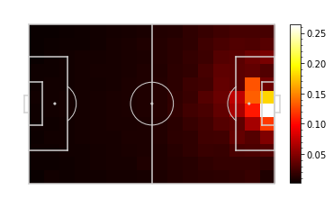
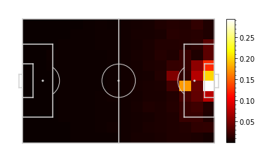
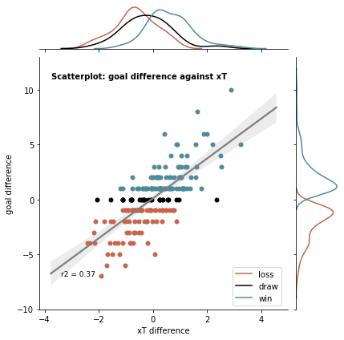
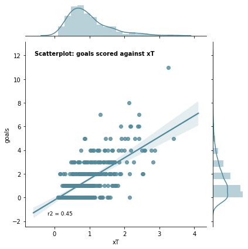
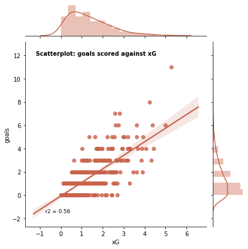
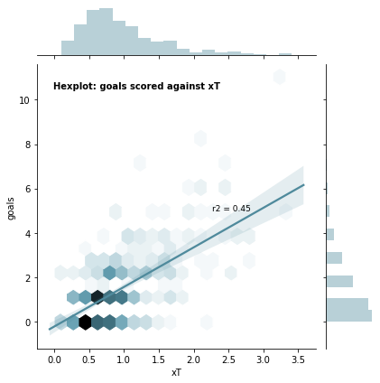
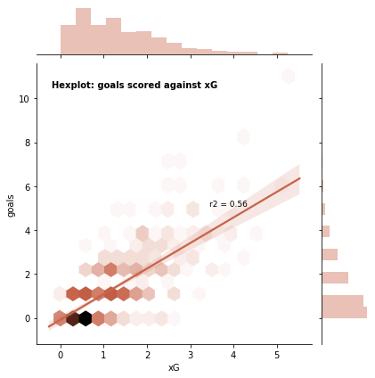
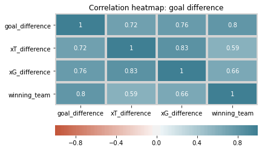
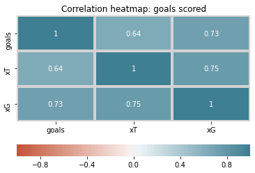

# Effective_models_for_winning_football_games
Jupyter Notebook used for my blogpost "Effective models for winning football games":
https://medium.com/@milanklaasman/effective-models-for-winning-football-games-1428e0c735ee

  
  
  
  
  

